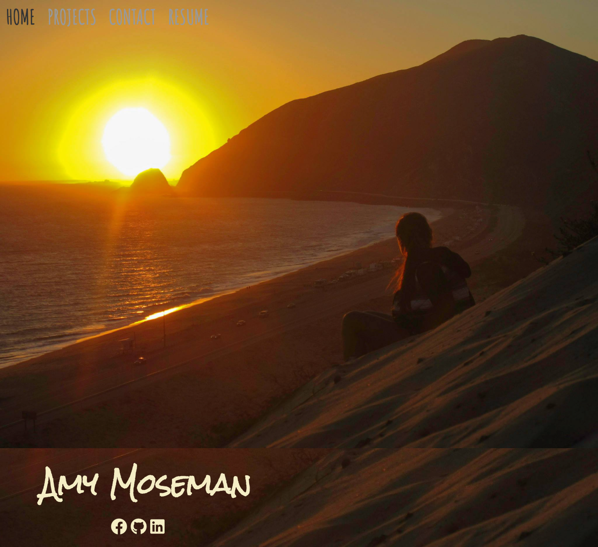
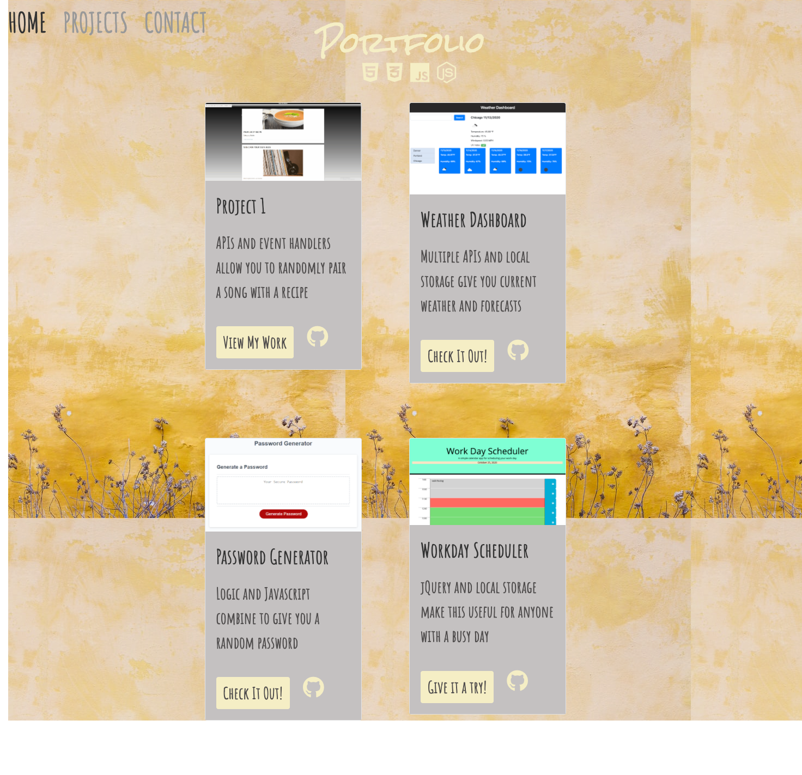
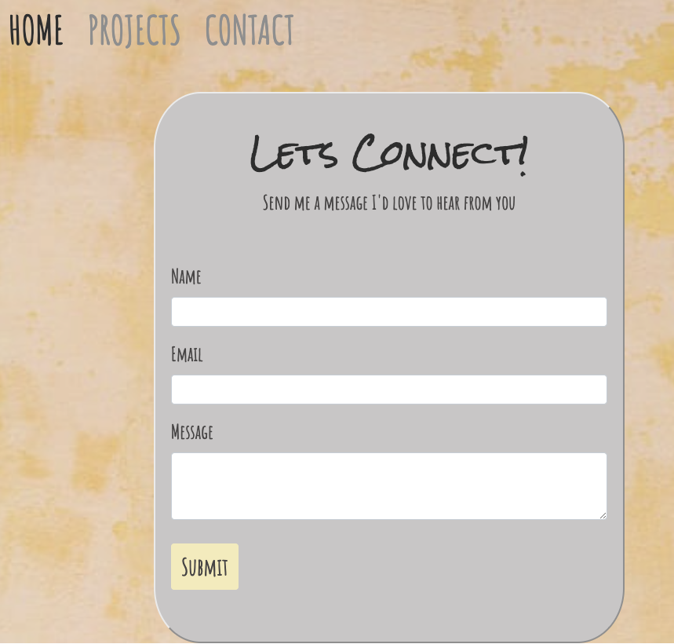
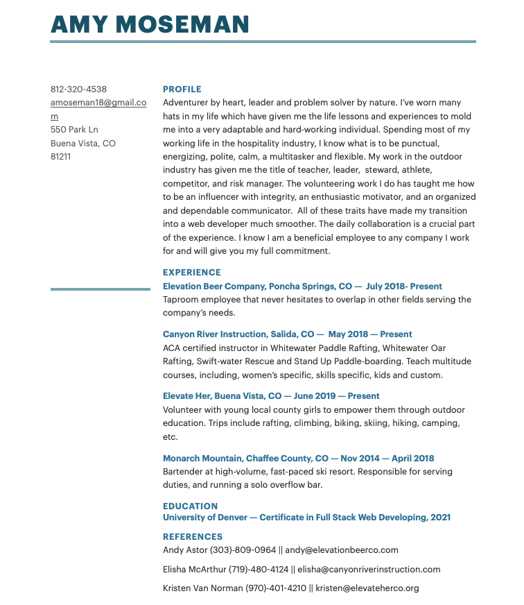

# ResponsivePortfolio

This is an updated self-portfolio created to showcase and link the projects I have completed up to this point. I complertely changed the styling of all the pages, and created new css files for each page separately. I also updated my linkedIn and github profiles along with an uploaded resume as a pdf file. With the projects page, I linked the github icon to my code of rthe project along with a button that takes you to my deployed application. I also incuded code for each clickable button or icon to open in a new page.

**_URL for deployed webpage:_**

[Responsive Portfolio] (https://amoseman1.github.io/ResponsivePortfolio)

**_Screenshots of each linked page:_**

